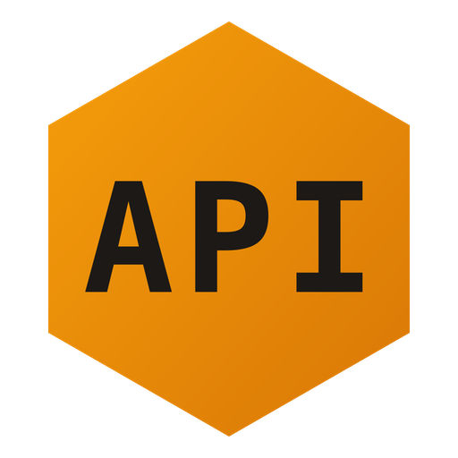

<p align="center">
  
</p>

<h1 align="center">Reqtor</h1>

<p align="center">
  A desktop API development environment for building, testing, and documenting HTTP APIs.
</p>

<p align="center">
  <a href="https://github.com/MehmetMelik/reqtor/releases/latest">
    
  </a>
  <a href="https://github.com/MehmetMelik/reqtor/blob/main/LICENSE">
    
  </a>
  <a href="https://github.com/MehmetMelik/reqtor/actions/workflows/ci.yml">
    
  </a>
  
</p>

<p align="center">
  Built with <a href="https://tauri.app/">Tauri 2</a>, React, TypeScript, and Rust.
</p>

---

## Features

- **HTTP Client** — Send GET, POST, PUT, PATCH, DELETE, HEAD, and OPTIONS requests with detailed response timing (DNS, connect, TLS, first byte, total)
- **Collections & Folders** — Organize requests into collections with nested folder hierarchies
- **Environments** — Define variables per environment and reference them with `{{variable}}` syntax in URLs, headers, query params, and request bodies
- **Encrypted Secrets** — Secret environment variables are encrypted at rest using AES-256-GCM with a machine-specific key
- **Request History** — Automatic logging of every request/response with full snapshots
- **Postman Import/Export** — Import and export Postman Collection v2.1 format
- **Export as Code** — Copy requests as cURL, wget, fetch, or HTTPie commands
- **Tabs** — Work on multiple requests simultaneously with per-tab isolation
- **Enterprise & Hacker Modes** — Enterprise mode for visual editors and confirmations; Hacker mode for keyboard-driven workflows, compact layout, and a command palette (Cmd+K)
- **Light & Dark Themes** — Toggle between light and dark UI themes

## Download

Download the latest version for your platform from the [Releases](https://github.com/MehmetMelik/reqtor/releases) page:

| Platform | Download |
|----------|----------|
| macOS (Apple Silicon) | `.dmg` |
| macOS (Intel) | `.dmg` |
| Windows | `.msi` or `.exe` |
| Linux | `.deb` or `.AppImage` |

## Architecture

```
Frontend (React + TypeScript)          Rust Backend (Tauri)
+--------------------------+          +-------------------------+
|  React Components        |          |  Tauri Commands          |
|  Zustand Stores          |--invoke--|    request::execute()    |
|  Domain Types (TS)       |          |    collection::*         |
|  Variable Resolution     |          |    environment::*        |
|  Postman Converter       |          |    history::*            |
|                          |<-result--|    crypto::encrypt()     |
+--------------------------+          |    io::import_postman()  |
                                      +-------------------------+
                                      |  SQLite (rusqlite)       |
                                      |  HTTP Engine (reqwest)   |
                                      |  Crypto (aes-gcm)        |
                                      +-------------------------+
```

- **TypeScript** handles UI rendering, state management, domain types, and pure operations (variable resolution, Postman format conversion)
- **Rust** handles all I/O: HTTP execution, database CRUD, file system access, encryption, and native dialogs

## Tech Stack

| Layer | Technology |
|-------|-----------|
| Desktop shell | Tauri 2 |
| Frontend | React 19, TypeScript, Vite 7 |
| Styling | Tailwind CSS 4 |
| State management | Zustand 5 |
| Backend | Rust (Tauri commands) |
| Database | SQLite via rusqlite |
| HTTP client | reqwest (Rust) |
| Encryption | AES-256-GCM via aes-gcm |
| Monorepo | pnpm workspaces + Turborepo |
| Testing | Vitest + cargo test |

## Development

### Prerequisites

- [Node.js](https://nodejs.org/) >= 20
- [pnpm](https://pnpm.io/) >= 9
- [Rust](https://www.rust-lang.org/tools/install) (stable toolchain)
- **Linux only:** `libwebkit2gtk-4.1-dev libappindicator3-dev librsvg2-dev patchelf libssl-dev libgtk-3-dev`

### Getting Started

```bash
# Clone the repository
git clone https://github.com/MehmetMelik/reqtor.git
cd reqtor

# Install dependencies
pnpm install

# Build the domain package
pnpm --filter @reqtor/domain build

# Start the development server (opens Tauri window with hot reload)
cd apps/desktop
pnpm tauri dev
```

### Scripts

From the repository root:

```bash
pnpm dev          # Start all apps in dev mode
pnpm build        # Build all packages and apps
pnpm test         # Run all tests
pnpm lint         # Run linters
pnpm format       # Format code with Prettier
```

### Testing

```bash
# TypeScript tests (domain package)
pnpm --filter @reqtor/domain test

# Rust tests
cd apps/desktop/src-tauri
cargo test
```

### Building for Production

```bash
cd apps/desktop
pnpm tauri build
```

This produces platform-specific installers:
- **macOS:** `.app` bundle and `.dmg` installer
- **Linux:** `.deb` and `.AppImage`
- **Windows:** `.msi` and `.exe` (NSIS)

Build artifacts are located in `apps/desktop/src-tauri/target/release/bundle/`.

## Project Structure

```
reqtor/
├── apps/
│   └── desktop/                  # Tauri desktop app
│       ├── src/                  # React frontend
│       │   ├── components/       # Shared UI components
│       │   ├── features/         # Feature modules
│       │   └── lib/              # Utilities (IPC client, cn)
│       └── src-tauri/            # Rust backend
│           └── src/
│               ├── commands/     # Tauri command handlers
│               ├── db/           # SQLite schema, migrations, repositories
│               ├── http/         # reqwest-based HTTP executor
│               ├── crypto/       # AES-GCM encryption
│               ├── io/           # Postman import/export
│               └── models/       # Rust domain types (serde)
├── packages/
│   ├── domain/                   # Pure TS domain types + operations
│   └── shared/                   # TS utilities, ID generation, constants
└── .github/workflows/            # CI and release workflows
```

## Contributing

Contributions are welcome! Please feel free to submit a Pull Request.

## License

This project is licensed under the [MIT License](LICENSE).
